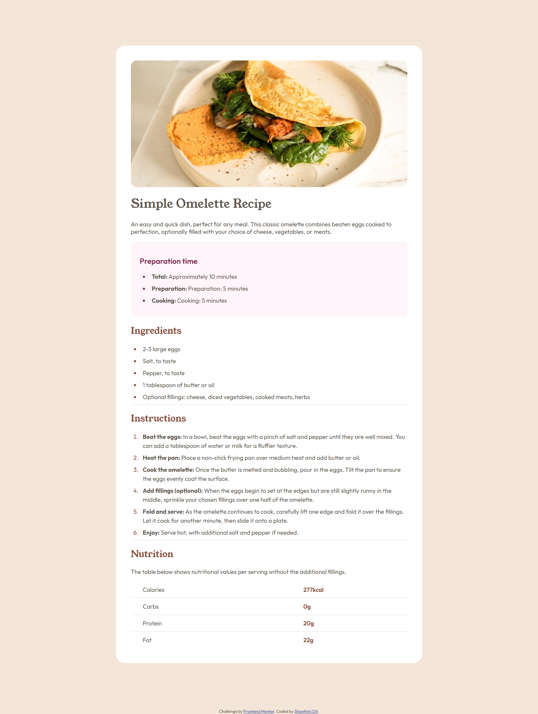
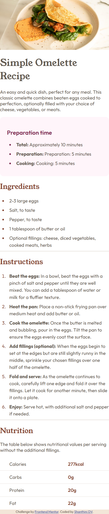
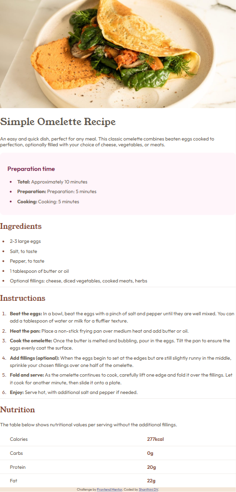
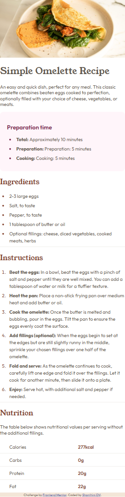

# Frontend Mentor - Recipe page solution

This is a solution to the [Recipe page challenge on Frontend Mentor](https://www.frontendmentor.io/challenges/recipe-page-KiTsR8QQKm).

## Table of contents

- [Overview](#overview)
  - [The challenge](#the-challenge)
  - [Screenshot](#screenshot)
  - [Links](#links)
- [My process](#my-process)
  - [Built with](#built-with)
  - [What I learned](#what-i-learned)
  - [Continued development](#continued-development)
  - [Useful resources](#useful-resources)
- [Author](#author)
- [Acknowledgments](#acknowledgments)

## Overview

### The challenge
  - This was my first project replicating a design, creating a single-page recipe card.
  - Making the layout respond to different screen sizes was the main task.
  - Additionally, I had to ensure there was a specific amount of empty space around the main content container on a desktop screen.
  - It was a fun challenge to make the design look pixel-perfect.
  
### Screenshot

------

------

------

---
### Links

- Solution URL: [https://github.com/shanthini01/ShanthiniDV-Recipe-Page-Main](https://github.com/shanthini01/ShanthiniDV-Recipe-Page-Main)
- Live Site URL: [https://shanthini01.github.io/ShanthiniDV-Recipe-Page-Main](https://shanthini01.github.io/ShanthiniDV-Recipe-page-Main)

------

## My process

### Built with
- HTML for the content and CSS for all the styling.
- I used media queries to handle the responsiveness.
- Mobile-first workflow.

### What I learned

- How to apply media queries to create a responsive layout and make the design look good on both mobile and desktop.
- How to layout the html using BEM css(Block, Element, Modifier).

### Continued development

- I plan to explore CSS Grid for more complex two-dimensional layouts.
- I will work on making the page more accessible for users with disabilities.
- I'd like to refactor my CSS to be more modular and scalable.

### Useful resources

- MDN Web Docs and W3Schools are my go-to resources for quick references.

## Author

- Frontend Mentor - [@shanthini01](https://www.frontendmentor.io/profile/shanthini01)

## Acknowledgments
- Big thanks to Frontend Mentor for the design! It was a great way to practice and build my portfolio.
